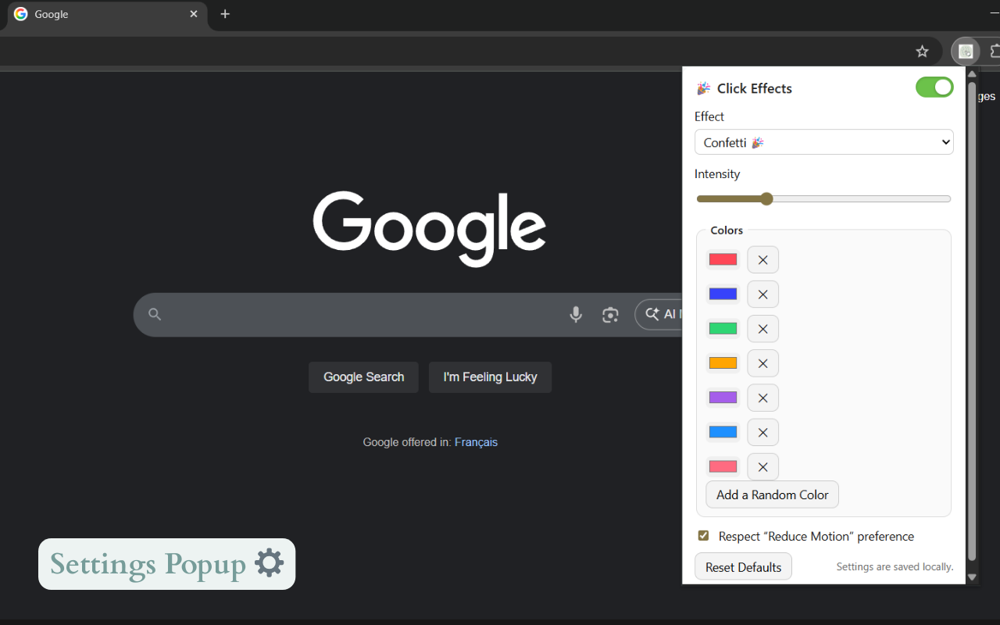
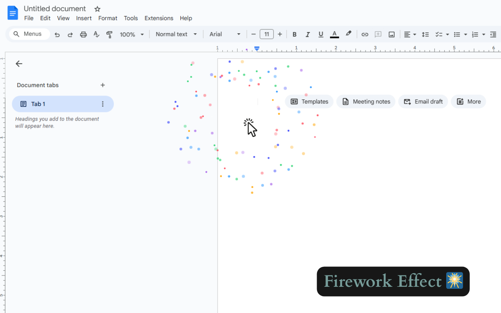

# Magic Clicks (Chrome Extension)

Add delightful animations wherever you click! Purely client-side, Manifest V3.

## Screenshots

## Features

- Toggle on/off from the toolbar popup
- Effects: Confetti, Fireworks, Balloons
- Adjustable intensity
- Custom color palette
- Respects `prefers-reduced-motion`

## Download

- Available on the Chrome Web Store: https://chromewebstore.google.com/detail/magic-clicks/ojdoapnhdnnabkfelmkahfmemnjgeofe

## Install (Developer Mode)

1. Open **chrome://extensions** in Chrome.
2. Toggle **Developer mode** (top right).
3. Click **Load unpacked** and select the folder containing this extension.
4. Pin the extension icon (optional) for quick access.

## Usage

- Click the toolbar icon to open the popup.
- Toggle **Enabled**.
- Pick an **Effect**, **Intensity**, and **Colors**.
- With the extension enabled, click anywhere on a webpage → enjoy the burst!

## Permissions

- `storage` for saving your local settings.
- `host_permissions: <all_urls>` so the content script can run on the pages you visit.
